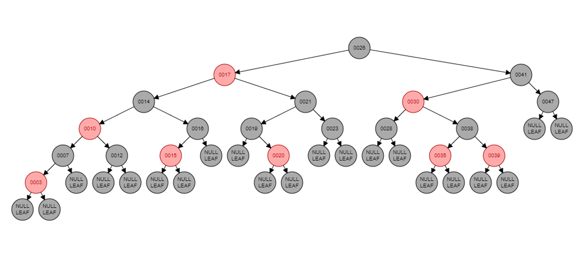
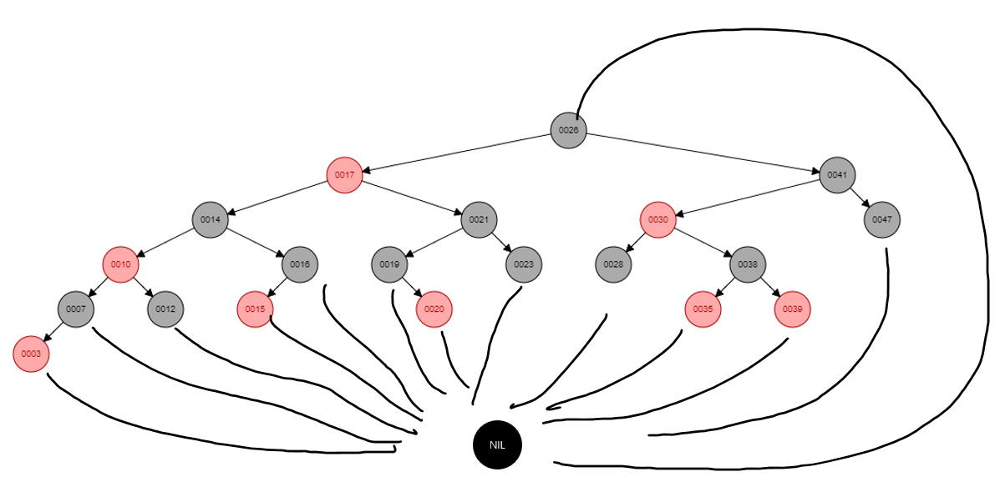
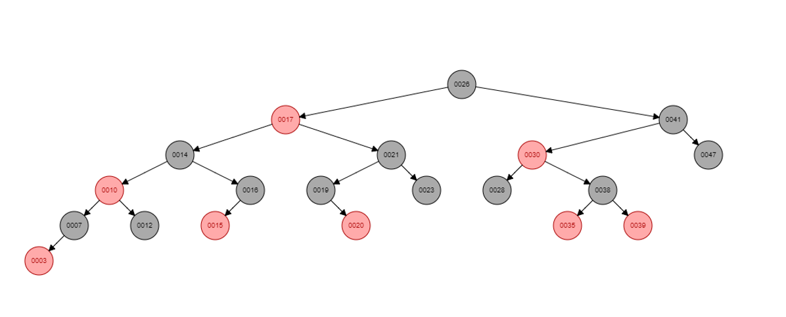

# 红黑树

## 1、什么是红黑树
红黑树是一种自平衡的二叉查找树。对于刚学习的人了解清楚这句话就够了，重点在于怎么做到自平衡，和为什么有红色和黑色。（当然，在你学习红黑树之前你肯定要知道什么是二叉查找树。

---

## 2、为什么需要红黑树？
以初学者的视角来说（起码我自己的学习顺序来说），明明已经有了二叉平衡树了，为什么还需要有红黑树呢？
因为二叉平衡树的规则太过于严苛，当数据量足够大并且插入和删除操作频繁发生的情况下，新增数据很容易引起旋转操作以用于保持平衡，从而导致插入和删除的效率大大下降。红黑树的出现，则通过维系其固定的规则，达到牺牲了一定的查找效率但降低了插入和删除的操作旋转次数。至于是怎么做到的，又可以降低到多少，看完这个帖子我相信你就可以有概念并且可以算出来。

---

## 3、红黑树的五个基础特性
 1. 每个节点不是红色就是黑色的；
 2. 根节点是黑色的；
 3. 红黑树的每一个叶子节点（叶子节点是NULL节点）都是黑色的；
 4. 红色节点的孩子节点一定是黑色的，因此可得红色节点的父母节点也一定是黑色的；
 5. 对每个结点，从该节点到其所有后代的叶子节点的简单路径上，均包含相同数目的会黑色结点（俗称为黑高相同）。

---

## 4、特性解释
关于红黑树为什么是红色和黑色这件事情，我一直不懂（在我还没开始看《算法导论》之前），直到我搜到掘金上的一篇帖子
https://juejin.cn/post/6844904097141768199

**红色和黑色是为了更快的判断此树是不是满足平衡的条件**

在插入或者删除导致树失衡的情况下，能通过颜色的变换来重新获得平衡，满足红黑树本身平衡条件的话，**可以避免过多的旋转导致操作开销过大**。单纯染色的操作开销远比旋转小，但必要的时候红黑树自平衡还是需要使用到少量的旋转操作。

---

## 5、补充

这是一棵红黑树，每个结点都是红色或者黑色，红色结点的两个子节点都是黑色，且每个结点到其后代叶节点的每条简单路径上，都包含相同数目的黑色结点。同时可以看到每个名字为**NULLLEAF**的结点都是叶子结点，且都是黑色的。

---

为了便于处理代码种的边界条件，使用一个哨兵（黑色，NIL）来代表所有的叶子结点（黑色，NULLLEAF）。哨兵结点是一个跟树中普通结点有相同属性的结点。它的颜色为黑，而它的父结点，左孩子结点，右孩子结点和键值可以被设置为任意值，所有指向叶子结点的指针都会指向哨兵结点。设置根节点的父结点也为这个哨兵结点。

---

同样的一颗红黑树，省略哨兵结点。

---