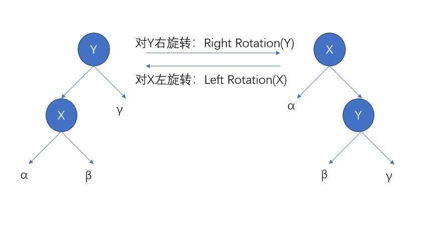
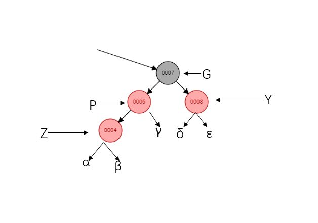

# 捏造红黑树
## 1、二叉树的旋转
必要我觉得要学习红黑树的话，本身就已经对旋转这个操作有理解。这里简单带过一下


**伪代码实现左旋转**
```
LeftRotation(X)
    Y = X.right
    X.right = Y.left        //将y的左子树转移到x的右子树上
    if (Y.left != NIL)     //避免设置哨兵的其他属性
        Y.left.p = X         
    Y.p = X.p               //将x的父母链接到y上
    if (X.p == NIL)        
        Root = Y
    else if (X == X.p.left)
        X.p.left = Y
    else 
        X.p.right = Y
    Y.left = X          //将x放到y的左子树上
    X.p = Y
```
**右旋转的代码大同小异，不过是将方向调转**

## 2、插入
### 2.1 前言
上一章已经说明，新插入的节点我们会默认为红色。但是当插入红色的新结点的父结点也为红色的，我们就开始真正面对红黑树的复杂。

### 2.2 伪代码
**在这里我们先给出对应的伪代码实现过程，然后再从实际的例子看如何操作。**
```
Insert(Z)
    Y = NIL
    X = Root
    while (X != NIL)
        Y = X
        if (Z.key < X.key)
            X = X.left
        else
            X = X.right
    Z.p = Y                //找到新节点的插入位置
    if (Y == NIL)
        Root = Z
    else if (Z.key < Y.key)
        Y.left = Z
    else
        Y.right = Z
    Z.left = NIL
    Z.right = NIL
    Z.color = RED
    InsertFixup(Z)          
```
**在插入后，调用InsertFixup()函数，下面是伪代码实现**
```
InsertFixup(Z) 
    while (Z.p.color == RED)
        if (Z.p == Z.p.p.left)
            Y = Z.p.p.right

            if (Y.color == RED)        //case 1
                Z.p.color = BLACK
                Y.color = BLACK
                Z.p.p.color = RED
                Z = Z.p.p             //case 1

            else 

                if (Z == Z.p.right)     //case 2
                    Z = Z.p
                    LeftRotation(Z)     //case 2

                Z.p.color = BLACK       //case 3
                Z.p.p.color = RED
                RightRotation(Z.p.p)    //case 3
        
        else 
            ... //跟上面相反即Z的父节点为Z的祖父节点的右节点的时候
    Root.color = BLACK
```

### 2.3 实例解析
因为新插入的节点**Z**颜色为红色，所以我们结合红黑树的原则来看，会因为插入后导致红黑树失衡的只有两种情况：1、**插入的Z节点为根节点**；2、**插入的Z节点跟父节点同为红色**。第一点的修复调整应该很易想得到，就是将根节点染为黑色即可。那么第二点呢？

如果当其父节点**P**为红色的时候（易得祖父节点**G**为黑色），我们就需要在插入节点后进行调整（InsertFixup函数主要做的工作，循函数内主循环也会停止在基准节点**Z**（红色）的父节点**P**为黑色的时候）。

我们再明确一个概念，一个节点的**黑色深度**为：**其子节点的黑色深度是指从该节点到其子节点（包括叶子节点）的路径上的黑色节点数量。**

在上述的大前提下，我们开始讨论，根据其父节点的兄弟节点**Y**的颜色分情况：

#### 1、父节点的兄弟节点也为红色（CASE1）

我们假设根节点到祖父节点G的黑色节点数量（不包括G节点）为A，因为插入之前是平衡的，而且插入的是红色节点，简单可得子树α、β、γ、δ和 ε上的黑色节点数量都一样，假设其为B，那么在插入前，从根节点到子树α、β、γ、δ和 ε上的叶子节点的黑色节点数量，换种说法是从根节点经过G节点的所有路径上的黑色节点数量应该为A+B+1。此时很容易想到，将父节点P及其兄弟节点Y的这一层的红色，跟祖父节点G的黑色互换的话，那么从根节点到子树α、β、γ、δ和 ε上的叶子节点的黑色节点数量还是为A+B+1。并且**新Z节点跟其父节点P同为红色**的问题不也已经解决了？实际操作为将祖父**G**染红，然后父节点**P**以及父节点的兄弟节点**Y**染黑。


但我们注意到，因为**G**被染成了红色，且它本来的颜色为黑色，当**祖父G节点的父节点**的颜色万一也是红色的话，或者**祖父G节点**为根节点的时候，就会还是违反了红黑树的原则。

所以我们将**G**节点设定为新的的**Z**基准节点去重新进入这个循环，直到基准节点的父节点的颜色为黑色。（根节点的父节点为哨兵节点，哨兵节点的颜色为黑色，如上一章补充所示）

#### 2、父节点的兄弟节点为黑色

那么我们此时需要看**新节点Z**是否跟**父节点P**为同一边。同一边的定义为：如果父节点为祖父节点的左孩子，**新节点Z**为**父节点P**的左孩子。非同一边的定义则相反。

##### 2.1新插入节点跟父节点在同一边时（CASE3）


思路是一样的，我们假设根节点到祖父节点G的黑色节点数量（不包括G节点）为A，因为插入之前是平衡的，而且插入的是红色节点，简单可得α、β等子树的黑色节点数量都一样，假设其为B，那么在插入前，从根节点到α、β等子树上的叶子节点的的黑色节点数量，换种说法是从根节点经过G节点的所有路径上的黑色节点数量为A+B+2。那么我们将祖父节点和父节点的颜色互换，意味着将父节点染黑，祖父节点染红，然后以父节点为基准进行右转，此时我们得到。


很容易从图上看到，从根节点到α、β等子树的黑色节点数量，换种说法是从根节点经过G节点的所有路径上的黑色节点数量应该为A+B+2。（尽管该例子的根节点发生了改变，A应该为0）

##### 2.2新插入节点跟父节点不在同一边时（CASE2）


我们将**Z**节点指向原来的父节点，然后以父节点为基准进行左旋，这个时候我们可以看到，这就是上述情形2.1。


而且你可以从图上看到，从根节点到α、β等子树的上的叶子节点的黑色节点数量没有变化，所以按着上述情形2.1进行操作即可。

### 2.4 总结

总的来说，插入新的红色节点的时候，如果新节点的父节点为红色，则以该新的节点为基准节点进入调整循环，直至基准节点的父节点为黑色。此时根据父节点的兄弟节点，即叔节点的颜色进行分情况讨论。如果叔节点的颜色为红色，即代码中的case1，进行染色操作，然后将基准节点往上调整继续循环。如果叔节点的颜色为黑色，是无法通过单纯的染色操作来使红黑树继续平衡（自己可以试一下），我们需要根据**Z**节点和**P**节点是否在同一边的，不是在同一边的话需要转到先转到同一边，即代码中的case2，是同一边的再进行染色旋转调整，即代码中的case3。